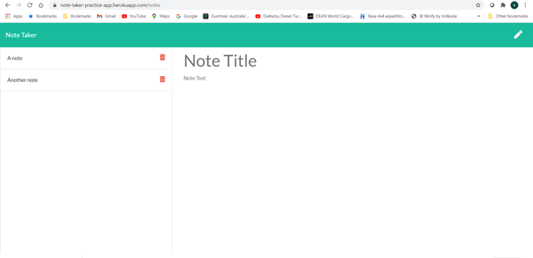

# Note-taker-practice-app
A simple team note taker app that has been developed to practice interactions using Express.js. 

## Author
github.com/spaniel-boone

## Description
This application has been developed as a learning tool to understand the usage of Express as a tool to provide database interactions to web-based applications.  

The app provides the user the ability to:
 1. Enter a note with a note title
 2. To save that note to a local database
 3. To recall that note to the main screen in order to review details
 4. To delete completed or defunct notes

Key learnings from this project were:
  - Installation, usage, and use-cases of get, post and delete methods on application routing using express. 
  - Deployment of applications on locally, and usage of npm module 'nodemon' to 'watch' the deployment and observe issues
  - Deployment of applications to Heroku by linking to a github repo. 

## Table of Contents
- [Installation](#installation)
- [Usage](#usage)
- [Features](#features)

## Installation
- You must have Node installed on your computer. See here https://nodejs.org/en/download/. 
- Check that you have the latest version of npm installed. In node type this into the console: 'npm install npm@latest -g'
- Ensure you have the following npm modules installed:
    * fs
    * uniqid (a module to easily generate unique id's)

- Run the program!
    * visit: https://note-taker-practice-app.herokuapp.com/
    * alternatively, clone the repo locally and run using either 'npm run' or 'npm run watch' (if you are using nodemon) in the root folder. 

## Usage
The Note-taker-practice-app is a simple note-taking application. 

It has been developed using simple express methods 'get', 'post' and 'delete'. A screenshot of the application (/notes.html page) is shown below. 

